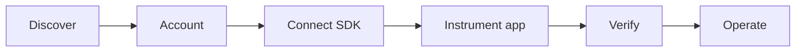

# AgentCOGS

**Per-customer LLM economics for B2B agent SaaS** — know what each tenant costs, whether you still make money on them, and when spend spikes before the invoice arrives.

[](LICENSE)
[](https://www.python.org/downloads/)
[](https://github.com/vaibhav11123/agentcogs/actions/workflows/ci.yml)

<p align="center">
  
</p>

<p align="center">
  <em>Month-to-date AI cost and gross margin per customer — not a spreadsheet export.</em>
</p>

---

## The problem

You sell AI agents to **other companies** (tenants). Each tenant runs different workflows, models, and volumes. Your LLM bill is one number on the provider invoice — but **finance needs it per customer**.

| Without AgentCOGS | With AgentCOGS |
|-------------------|----------------|
| Export Langfuse / proxy logs into Excel | Live leaderboard: cost, revenue, margin % per tenant |
| Guess which `userId` maps to which account | Use your existing `org_id` / `tenant_id` |
| Find out a customer is unprofitable at renewal | See margin and budget status before the QBR |
| No runtime guardrail when a tenant blows the budget | Optional `monthly_budget_usd` + `CustomerBudgetExceededError` |

AgentCOGS is **not** a tracing tool (use [Langfuse](https://langfuse.com) for spans and debugging). It is the **unit economics layer**: cost + revenue + margin + budgets, per B2B customer.

---

## Who it's for

| Role | What you get |
|------|----------------|
| **Founder / PM** | Answer “which customers are profitable?” from the dashboard, not a spreadsheet |
| **Backend engineer** | `set_customer()` + `run()` — two lines around existing OpenAI / Anthropic / LangGraph code |
| **Platform / infra** | Self-host API + dashboard in your VPC; MIT, full stack in this repo |
| **Finance / ops** | CSV export, Slack alerts on cost spikes, Stripe meter sync (partial) |

**Typical products:** vertical copilots, support agents, research bots, document pipelines — anything where **one subscription maps to many LLM runs per month**.

---

## Customer journey (start to operate)

North star: **signup → first cost row in the dashboard in under 10 minutes** (no Docker required for SDK-only path).



### 1. Discover

You find AgentCOGS via GitHub, docs, or a founder thread. You need **per-tenant LLM P&L**, not another trace UI.

### 2. Account

| You do | Product |
|--------|---------|
| Enter work email | Magic-link auth (`POST /v1/auth/*`) |
| Land in workspace | API key + workspace id created |

Hosted signup at `app.agentcogs.dev` may be offline — **self-host** or run `./tools/seed_demo.sh` for a local workspace.

### 3. Connect the SDK (~5 min)

| You do | Product |
|--------|---------|
| `pip install agentcogs` | PyPI package |
| Copy snippet from Settings or `/onboarding` | Pre-filled `init()` + `set_customer` + `run()` |
| `agentcogs.ping()` | Confirms key, workspace, endpoint (`GET /v1/sdk/ping`) |

<p align="center">
  
</p>

### 4. Instrument your app (~5 min)

| You do | Product |
|--------|---------|
| `agentcogs.set_customer(tenant_id)` once per HTTP request or job | Context propagates to all LLM calls in that scope |
| `with agentcogs.run(workflow_id="support_bot"):` around agent code | Shekel records token/cost at the LLM boundary |
| Optional: FastAPI middleware | [AgentCOGSMiddleware](docs/integrations/fastapi.md) reads `request.state.tenant_id` |
| Optional: LangGraph helper | [`agentcogs_run()`](docs/integrations/langgraph.md) |

```python
import agentcogs

agentcogs.init()  # AGENTCOGS_API_KEY, AGENTCOGS_WORKSPACE_ID, AGENTCOGS_ENDPOINT

agentcogs.set_customer(request.state.tenant_id)  # same id as your tenants table

with agentcogs.run(workflow_id="support_bot"):
    result = graph.invoke(state)  # OpenAI, Anthropic, LangGraph, etc.
```

**Rules:** the SDK never guesses the tenant. Wrong attribution is worse than a missing `customer_id`. See [customer-id mapping](docs/concepts/customer-id.md).

### 5. Verify (first value)

| You do | Product |
|--------|---------|
| Run `examples/hello_agentcogs.py` or one real agent request | `POST /v1/ingest` → **202** (async, non-blocking) |
| Open **Customers** | Row appears for your `customer_id` (lazy create on first ingest) |
| Onboarding polls until first event | `/onboarding` redirects to leaderboard |

**Terminal proof:** `ping()` → `ingest_accepted=True` — see [hello_agentcogs terminal output](#demo-paths-terminal--ui).

**Dashboard:** month-to-date **AI cost**, **revenue**, **margin %**, **budget status** — [dashboard UI](#dashboard-ui) below.

### 6. Operate (ongoing)

| You do | Product |
|--------|---------|
| Set `monthly_revenue_usd` per customer | Margin % and blended margin KPI |
| Set `monthly_budget_usd` | Runtime cap; dashboard pills; optional block in SDK |
| Drill into a customer | Daily cost vs revenue chart, cost by workflow node, event log |
| Configure Slack webhook | Email + Slack on cost-spike anomalies |
| Optional: Stripe Connect | Nightly meter sync (partial) |

<p align="center">
  
</p>

<p align="center">
  
</p>

---

## Demo paths (terminal + UI)

Pick the path that matches your goal. **Do not** use `prototype/demo.py` to validate real ingest — it prints mock JSON only.

| Goal | Command | What you get |
|------|---------|----------------|
| **Prove SDK → API** | `python3 examples/hello_agentcogs.py` | Real ingest; row in dashboard |
| **Live LLM + ingest (demo stack)** | `python3 scripts/run_live_pipeline.py` | Claude call → `agentcogs.run()` → dashboard |
| **Sales call (no backend)** | `python3 prototype/demo.py` | Mock cost JSON; press Enter twice |
| **Shekel only (no AgentCOGS)** | `python3 prototype/shekel_smoke.py` | Live LLM + cost JSON; no ingest |
| **SDK smoke (offline)** | `python3 scripts/smoke/manual_test.py` | `run()` + outbox; no API |
| **SDK smoke (local API)** | `python3 scripts/smoke/integration_test.py` | Ingest to Postgres on `:8000` |
| **Check failed ingests** | `python3 -m agentcogs outbox status` | Local outbox queue |
| **Full local stack** | `./tools/seed_demo.sh && ./tools/start_demo.sh` | Docker + seeded UI at `/demo` |

See also [prototype/README.md](prototype/README.md) and [scripts/smoke/README.md](scripts/smoke/README.md).

### Terminal — SDK proof (`hello_agentcogs.py`)

```bash
pip install agentcogs
set -a && source tools/.demo_env && set +a   # after seed_demo.sh
export AGENTCOGS_ENDPOINT=http://localhost:8000
python3 examples/hello_agentcogs.py
```

<p align="center">
  
</p>

### Terminal — sales mock (`prototype/demo.py`)

No API keys. Interactive walkthrough; prints the JSON that would be ingested.

<p align="center">
  
</p>

### Terminal — live pipeline (`scripts/run_live_pipeline.py`)

Real Claude call + AgentCOGS ingest into the **demo** workspace (after `seed_demo.sh` + `start_demo.sh`):

```bash
export ANTHROPIC_API_KEY='...'
python3 scripts/run_live_pipeline.py --customer pied_piper
# → Open http://localhost:5173/demo
```

<p align="center">
  
</p>

### Terminal — Shekel prototype (`prototype/shekel_smoke.py`)

Cost tracking **without** AgentCOGS — useful to show Shekel/LLM pricing before wiring ingest:

```bash
export ANTHROPIC_API_KEY='...'
python3 prototype/shekel_smoke.py
# → prints 📊 COST EVENT: { run_id, customer_id, total_usd, models, ... }
```

<p align="center">
  
</p>

### Terminal — smoke scripts (`scripts/smoke/`)

| Script | Screenshot |
|--------|------------|
| `manual_test.py` — offline `run()`, no network |  |
| `integration_test.py` — ingest to local API (`SKIP_OPENAI=1` ok) |  |

### Terminal — outbox status

If ingest fails briefly, events queue locally at `~/.agentcogs/outbox.db`:

<p align="center">
  
</p>

### Dashboard UI {#dashboard-ui}

After `./tools/seed_demo.sh && ./tools/start_demo.sh` → http://localhost:5173/demo

| View | Screenshot |
|------|------------|
| **Leaderboard** |  |
| **Settings** |  |
| **Customer drill-down** |  |
| **Alerts** |  |

---

## What you can do (feature map)

| Capability | How it helps | Where |
|------------|--------------|-------|
| **Per-customer cost ingest** | Every LLM run tied to `customer_id` + `workflow_id` | SDK → `POST /v1/ingest` |
| **Margin leaderboard** | Sort tenants by who burns margin | Dashboard `/` |
| **Revenue per customer** | Compare AI cost to what they pay you | Editable in UI or import API |
| **Budget caps** | Stop runaway tenant before month-end | Dashboard + `CustomerBudgetExceededError` |
| **Cost by workflow node** | See if `classify` or `merge` dominates spend | Customer detail |
| **Outbox + retry** | Ingest survives brief API outages | `~/.agentcogs/outbox.db`, `python -m agentcogs outbox status` |
| **Slack / email alerts** | Ops notified on 2.5σ / 3× spend spikes | [Slack integration](docs/integrations/slack.md) |
| **LiteLLM proxy callback** | Attribute proxy traffic without wrapping app code | [litellm.md](docs/integrations/litellm.md) (upstream PR) |
| **Customer import** | Pre-seed names, revenue, budgets before first run | `POST /v1/customers/import` |

---

## How AgentCOGS compares

| Tool | Primary job | AgentCOGS |
|------|-------------|-----------|
| **Langfuse / LangSmith** | Traces, evals, prompt management | Complements — use both; AgentCOGS = **per-customer P&L** |
| **LiteLLM proxy** | Routing, keys, team spend | Works with — callback sends per-tenant cost to AgentCOGS |
| **Lago / Stripe Billing** | Invoicing, subscriptions, usage meters | AgentCOGS feeds **attributed cost**; Stripe sync is optional |
| **Cloud provider bills** | Total OpenAI/Anthropic spend | AgentCOGS splits that spend **by your tenant id** |

---

## Quick start

```bash
pip install agentcogs
export AGENTCOGS_API_KEY='acg_live_...'
export AGENTCOGS_WORKSPACE_ID='your-workspace-uuid'
export AGENTCOGS_ENDPOINT='http://localhost:8000'   # your API; omit when hosted is live

python3 examples/hello_agentcogs.py
```

→ Full guide: **[docs/quickstart.md](docs/quickstart.md)** (~10 min to first dashboard row)

---

## Try the demo locally

```bash
./tools/seed_demo.sh && ./tools/start_demo.sh
# Dashboard: http://localhost:5173/demo
```

Seeded personas (Acme Corp, etc.) with realistic cost. UI + terminal captures: [docs/assets/](docs/assets/terminal/README.md).

---

## Self-host

| Step | Command |
|------|---------|
| Full stack smoke test | `./test_e2e.sh` |
| API | `cd backend && cp .env.example .env` → [backend/README.md](backend/README.md) |
| UI | `cd dashboard && cp .env.example .env` → `npm ci && npm run dev` |

**Stack:** Python SDK · FastAPI · Postgres · Redis · React dashboard · MIT license.

> **Hosted product:** `api.agentcogs.dev` / `app.agentcogs.dev` may not be live yet. Self-host or run the demo until deploy.

---

## Integrations

| Integration | Use when |
|-------------|----------|
| [FastAPI](docs/integrations/fastapi.md) | You want `tenant_id` from `request.state` automatically |
| [LangGraph](docs/integrations/langgraph.md) | LangGraph graphs with `agentcogs_run()` |
| [LiteLLM](docs/integrations/litellm.md) | Traffic goes through LiteLLM proxy |
| [Slack](docs/integrations/slack.md) | Ops wants spike alerts in a channel |
| [Customer import](docs/integrations/customer-import.md) | Pre-load CRM tenants before first LLM event |

---

## Monorepo

| Path | Description |
|------|-------------|
| `src/agentcogs/` | `pip install agentcogs` |
| `backend/` | Ingest + dashboard API |
| `dashboard/` | React UI |
| `docs/` | [Documentation index](docs/README.md) |
| `examples/hello_agentcogs.py` | Canonical proof script |

---

## Contributing & license

- [CONTRIBUTING.md](CONTRIBUTING.md) — PRs welcome; run `./scripts/install-githooks.sh` after clone  
- [SECURITY.md](SECURITY.md) — responsible disclosure  
- [MIT](LICENSE)

**Assets:** UI PNGs + terminal PNGs in `docs/assets/`. Regenerate UI from `http://localhost:5173/demo`; terminal via [docs/assets/terminal/README.md](docs/assets/terminal/README.md) and `scripts/render_terminal_png.py`.
