# AgentCOGS

**Per-customer LLM economics for B2B agent SaaS** — know what each tenant costs, whether you still make money on them, and when spend spikes before the invoice arrives.

[](LICENSE)
[](https://www.python.org/downloads/)
[](https://github.com/vaibhav11123/agentcogs/actions/workflows/ci.yml)

> [!NOTE]
> **Dashboard:** [agentcogs.vercel.app](https://agentcogs.vercel.app) · **API:** [agentcogs-api-production.up.railway.app](https://agentcogs-api-production.up.railway.app/health)  
> Custom domains `app.agentcogs.dev` / `api.agentcogs.dev` — DNS steps in [docs/DEPLOY.md](docs/DEPLOY.md). Self-host: same doc.

<p align="center">
  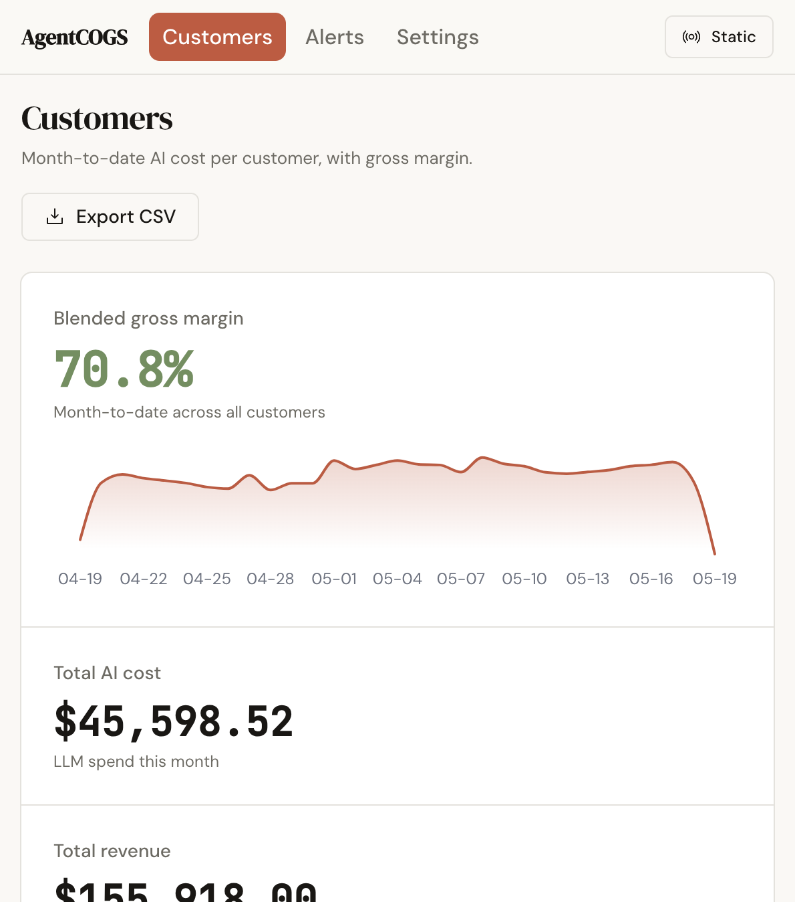
</p>

<p align="center">
  <em>Month-to-date AI cost and gross margin per customer — not a spreadsheet export.</em>
</p>

---

## The problem

You sell AI agents to **other companies** (tenants). Each tenant runs different workflows, models, and volumes. Your LLM bill is one number on the provider invoice — but **finance needs it per customer**.

| Without AgentCOGS | With AgentCOGS |
|-------------------|----------------|
| Export Langfuse / proxy logs into Excel | Live leaderboard: cost, revenue, margin % per tenant |
| Guess which `userId` maps to which account | Use your existing `org_id` / `tenant_id` |
| Find out a customer is unprofitable at renewal | See margin and budget status before the QBR |
| No runtime guardrail when a tenant blows the budget | Optional `monthly_budget_usd` + `CustomerBudgetExceededError` |

> **Accurate by design.** AgentCOGS never infers the customer from context —
> if no `customer_id` is set, the run is unattributed rather than misattributed.
> Your margin numbers are always exact, never estimated.

---

## Who it's for

| Who | What you get |
|-----|----------------|
| **Founder / CFO** | Know which customers are profitable before the QBR, not after |
| **Backend engineer** | Two lines around existing agent code — `set_customer()` + `run()` |
| **Platform / infra** | Self-host full stack in your VPC — `cp .env.selfhost.example .env && docker compose up -d --build` ([docs/DEPLOY.md](docs/DEPLOY.md)) |
| **Finance / ops** | CSV export, Slack alerts on cost spikes, Stripe meter sync |

**Typical products:** vertical copilots, support agents, research bots, document pipelines — anything where **one subscription maps to many LLM runs per month**.

---

## How AgentCOGS compares

| Tool | What it does | How AgentCOGS relates |
|------|--------------|------------------------|
| **Langfuse / LangSmith** | Traces, spans, evals — total cost visible, not per customer | AgentCOGS splits that total by which tenant caused it and whether they're profitable |
| **LiteLLM proxy** | Routing, keys, team spend (Enterprise: customer leaderboard) | Works with — callback sends per-tenant cost without replacing LiteLLM |
| **Lago / Stripe Billing** | Invoicing, usage meters, subscriptions | AgentCOGS feeds attributed cost into Stripe; you bill customers based on real usage |
| **OpenAI / Anthropic invoice** | One number, no customer breakdown | AgentCOGS is the missing join key between that invoice and your customer list |

---

## Quick start

**1. Open the dashboard** — [agentcogs.vercel.app](https://agentcogs.vercel.app) (magic-link sign-in → Settings for API key + workspace id)

**2. Install and instrument**

```bash
# TODO(A1): switch to `pip install agentcogs` once PyPI publish lands
pip install "agentcogs @ git+https://github.com/vaibhav11123/agentcogs"
```

> PyPI package coming this week — until then install from GitHub (above).

```python
import agentcogs

agentcogs.init()  # AGENTCOGS_API_KEY + AGENTCOGS_WORKSPACE_ID from Settings
agentcogs.set_customer(request.state.tenant_id)

with agentcogs.run(workflow_id="support_bot"):
    result = graph.invoke(state)
```

Production API (hosted): `https://agentcogs-api-production.up.railway.app` — or omit `AGENTCOGS_ENDPOINT` once `api.agentcogs.dev` DNS is live.

→ Full guide: [docs/quickstart.md](docs/quickstart.md)

<p align="center">
  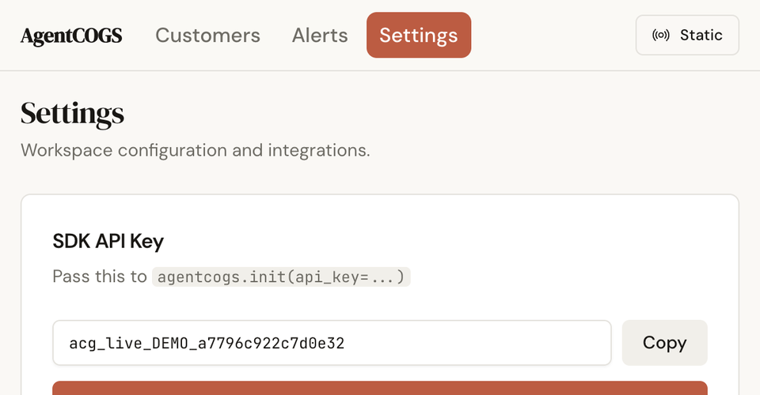
</p>

---

## Customer journey

North star: **first cost row in the dashboard in under 10 minutes**.

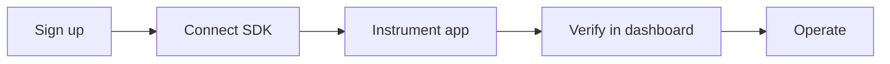

| Stage | You do | Product |
|-------|--------|---------|
| **Connect** | `pip install agentcogs`, copy keys from Settings | `init()`, `ping()` |
| **Instrument** | `set_customer(tenant_id)` + `run(workflow_id=...)` | Cost at LLM boundary via Shekel |
| **Verify** | Run agent or `examples/hello_agentcogs.py` | Customer row + margin on leaderboard |
| **Operate** | Revenue, budgets, alerts, drill-down | Dashboard + optional Stripe sync |

See [customer-id mapping](docs/concepts/customer-id.md), [FastAPI](docs/integrations/fastapi.md), [LangGraph](docs/integrations/langgraph.md).

<p align="center">
  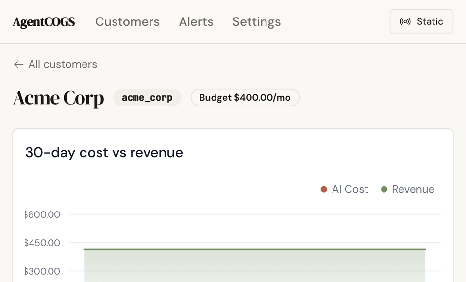
</p>

<p align="center">
  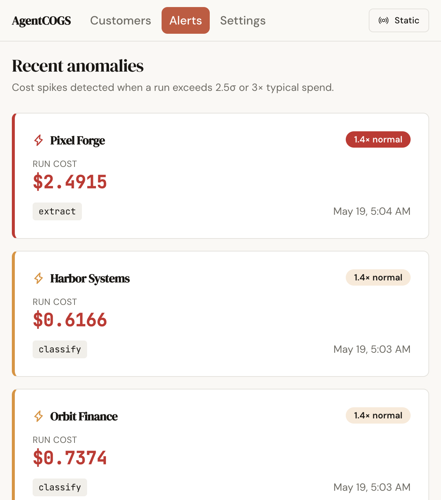
</p>

---

## Terminal output

SDK proof, live ingest, and smoke tests — commands in [docs/demo-paths.md](docs/demo-paths.md).

<p align="center">
  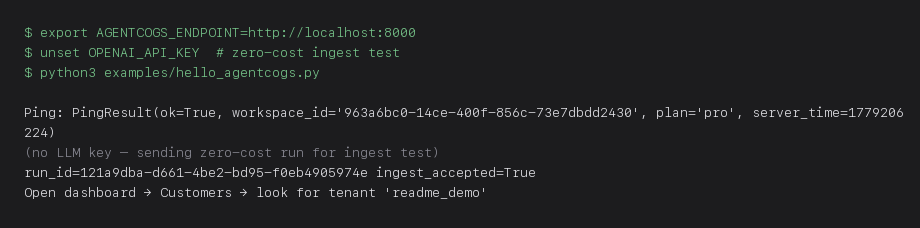
</p>

<p align="center">
  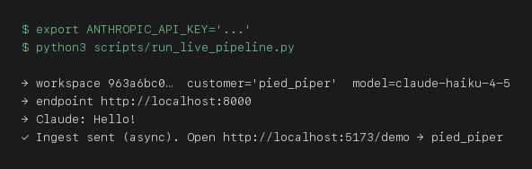
</p>

<p align="center">
  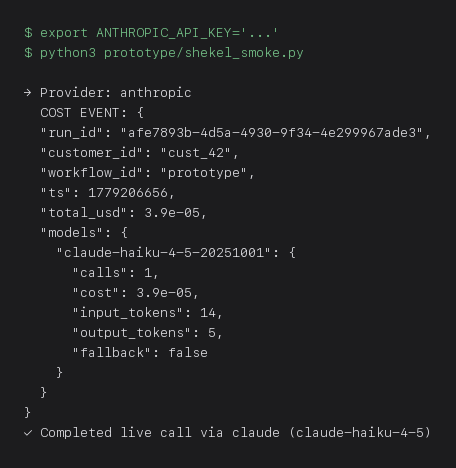
</p>

<p align="center">
  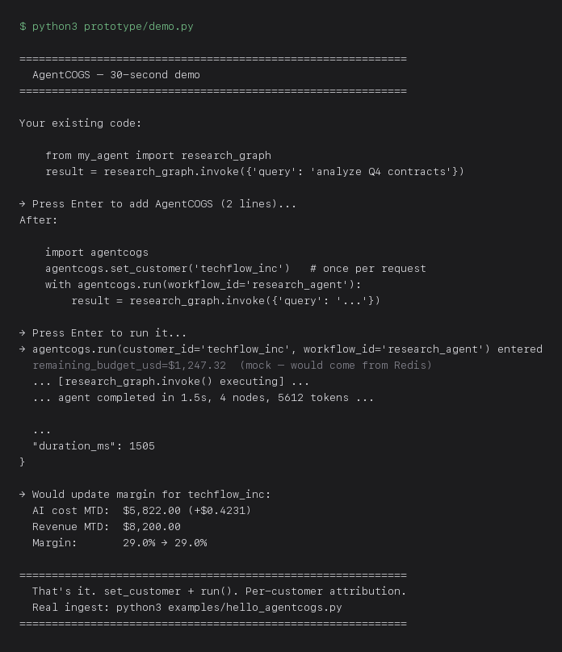
</p>

| Script | Output |
|--------|--------|
| `scripts/smoke/manual_test.py` | 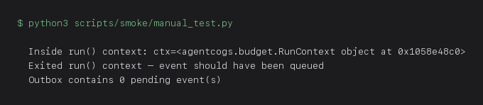 |
| `scripts/smoke/integration_test.py` | 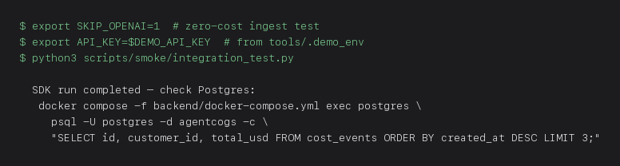 |

<p align="center">
  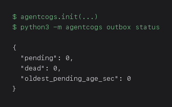
</p>

---

## What you can do

| Capability | How it helps | Where |
|------------|--------------|-------|
| **Per-customer cost ingest** | Every LLM run tied to `customer_id` + `workflow_id` | SDK → `POST /v1/ingest` |
| **Margin leaderboard** | Sort tenants by who burns margin | Dashboard `/` |
| **Revenue per customer** | Compare AI cost to what they pay you | Editable in UI or import API |
| **Budget caps** | Stop runaway tenant before month-end | Dashboard + `CustomerBudgetExceededError` |
| **Cost by workflow node** | See if `classify` or `merge` dominates spend | Customer detail |
| **Outbox + retry** | Ingest survives brief API outages | `~/.agentcogs/outbox.db` |
| **Slack / email alerts** | Ops notified on cost spikes | [Slack integration](docs/integrations/slack.md) |
| **LiteLLM proxy callback** | Attribute proxy traffic without wrapping app code | [LiteLLM integration](docs/integrations/litellm.md) |
| **Customer import** | Pre-seed names, revenue, budgets before first run | `POST /v1/customers/import` |

---

## Integrations

| Integration | Use when |
|-------------|----------|
| [FastAPI](docs/integrations/fastapi.md) | `tenant_id` from `request.state` automatically |
| [LangGraph](docs/integrations/langgraph.md) | LangGraph graphs with `agentcogs_run()` |
| [LiteLLM](docs/integrations/litellm.md) | Traffic goes through LiteLLM proxy |
| [Slack](docs/integrations/slack.md) | Ops wants spike alerts in a channel |
| [Customer import](docs/integrations/customer-import.md) | Pre-load CRM tenants before first LLM event |

---

## Monorepo

| Path | Description |
|------|-------------|
| `src/agentcogs/` | `pip install agentcogs` |
| `backend/` | Ingest + dashboard API |
| `dashboard/` | React UI |
| `docs/` | [Documentation index](docs/README.md) · [Deploy](docs/DEPLOY.md) |
| `examples/hello_agentcogs.py` | Minimal ingest example |

**Stack:** Python SDK · FastAPI · Postgres · Redis · React dashboard · MIT license.

---

## Contributing & license

- [CONTRIBUTING.md](CONTRIBUTING.md) — PRs welcome; run `./scripts/install-githooks.sh` after clone
- [SECURITY.md](SECURITY.md) — responsible disclosure
- [MIT](LICENSE)
