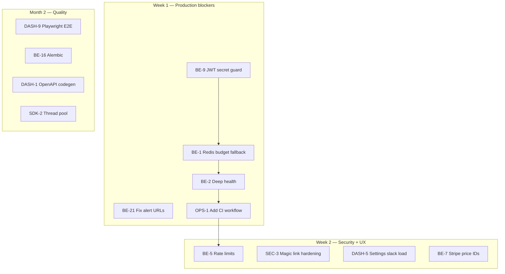

# AgentCOGS — Technical Debt Register

**Generated:** 2026-05-19  
**Codebase versions:** SDK `0.1.0` · Backend API `0.1.0` · Dashboard (Vite/React)  
**Related:** `TECH_ROADMAP.local.md` §12 (baseline TD-1–TD-10), `TEST_RESULTS.md`

This register is the expanded, evidence-backed inventory of technical debt across the monorepo. Each item includes severity, impact, code references, recommended remediation, and **industry solutions** from current practice (links in Sources).

---

## How to use this document

| Column | Meaning |
|--------|---------|
| **ID** | Stable identifier (`TD-NN` legacy + `AREA-NN` new) |
| **Severity** | P0 (prod blocker) → P3 (polish) |
| **Effort** | S (&lt;1 day) · M (1–3 days) · L (1–2 weeks) · XL (multi-sprint) |
| **Phase** | Suggested roadmap bucket (1 = pre-launch hardening, 2 = scale, 3 = platform) |

**Review cadence:** Weekly triage of P0/P1; monthly full register review; link closed items to PRs in the Decision log at the bottom.

---

## Severity definitions

| Level | Definition | Example |
|-------|------------|---------|
| **P0** | Data loss, security breach, or core product broken in production | Budget API 500 when Redis down; default JWT secret |
| **P1** | Major reliability, revenue, or compliance risk | No CI; broken alert links; ingest flooding |
| **P2** | Meaningful quality/maintainability cost; workaround exists | Manual migrations; no dashboard E2E |
| **P3** | Nice-to-have; low user impact | Hardcoded User-Agent version |

---

## Executive summary

| Metric | Count |
|--------|------:|
| Total registered items | **52** |
| P0 | **3** |
| P1 | **14** |
| P2 | **22** |
| P3 | **13** |

**Top 5 risks (fix first):**

1. **BE-1 / TD-3** — `/v1/budget` depends entirely on Redis; outage blocks budget checks (opposite of SDK fail-open).
2. **BE-9** — `jwt_secret` defaults to `dev-secret-change-me` if env unset.
3. **BE-21** — Alert drill URLs use `external_id` but dashboard routes expect customer UUID.
4. **OPS-1 / TD-10** — No PR CI (pytest, build, lint); PyPI publish has no test gate.
5. **BE-5** — No API rate limiting on ingest or magic-link auth.

**Architectural theme:** The system optimizes for **telemetry availability** (SDK fail-open, fire-and-forget ingest) but several **control-plane** paths (budget on server, auth, billing) are not yet production-hardened.

---

## Register — Operations & CI

### OPS-1 · No monorepo CI workflow

| Field | Value |
|-------|-------|
| **Severity** | P1 |
| **Effort** | M |
| **Phase** | 1 |
| **Area** | CI/CD |

**Issue:** Root `.github/workflows/` only has `publish.yml` (PyPI on release). No `ci.yml` running SDK/backend tests, dashboard build, or `test_e2e.sh`. `backend/.github/workflows/deploy.yml` is a placeholder echo.

**Evidence:** `.github/workflows/publish.yml`; `backend/.github/workflows/deploy.yml`; roadmap §8.2.

**Impact:** Regressions merge undetected; PyPI can ship without tests passing.

**Recommended fix:**

- Add path-filtered workflow: `tests/` + `src/` → SDK pytest; `backend/` → backend pytest; `dashboard/` → `npm run build`; optional nightly `test_e2e.sh` with Docker.
- Gate `publish.yml` on `ci` success for the release tag.

**Industry solutions:**

- [StackLesson — Alembic in CI/CD](https://www.stacklesson.com/react-fastapi/fastapi-alembic/ch25-lesson-05-alembic-in-ci-cd/) — run migrations in init job before app deploy; use `alembic check` on PRs to block missing migrations.
- GitHub Actions matrix: `setup-python` + `pytest` per package; cache pip/npm.

**Acceptance criteria:** Green CI on every PR to `main`; publish workflow `needs: test`.

---

### OPS-2 · Railway deploy workflow is stub

| Field | Value |
|-------|-------|
| **Severity** | P2 |
| **Effort** | S |
| **Phase** | 1 |

**Issue:** Deploy step does not invoke Railway API or CLI.

**Recommended fix:** Wire Railway GitHub integration or `railway up` with secrets; health-check URL after deploy.

---

### OPS-3 · PyPI publish without automated test gate

| Field | Value |
|-------|-------|
| **Severity** | P2 |
| **Effort** | S |
| **Phase** | 1 |

**Issue:** `publish.yml` builds and uploads on `release: published` only.

**Recommended fix:** `workflow_call` from CI or `needs: [test]` job running `pytest` + `python -m build` dry-run on PRs.

---

### OPS-4 · Docker image: multi-worker uvicorn, no healthcheck

| Field | Value |
|-------|-------|
| **Severity** | P2 |
| **Effort** | S |
| **Phase** | 1 |

**Issue:** Multiple workers without documented Redis connection handling; container health not tied to DB/Redis (see BE-2).

**Recommended fix:** `HEALTHCHECK` hitting `/health` (once deep health exists); document connection pool per worker or use single worker + horizontal replicas.

---

### OPS-5 · Conflicting Postgres ports (5433 vs 55432)

| Field | Value |
|-------|-------|
| **Severity** | P3 |
| **Effort** | S |
| **Phase** | 1 |

**Issue:** `backend/docker-compose.yml` vs `test_e2e.sh` / `scripts/test_e2e.sh` use different ports — friction for contributors.

**Recommended fix:** Single documented port in README; align compose and E2E scripts.

---

### OPS-6 · Production deploy checklist manual only

| Field | Value |
|-------|-------|
| **Severity** | P1 |
| **Effort** | M |
| **Phase** | 1 |

**Issue:** Roadmap §9.2 (Supabase, Upstash, Stripe cron, CORS, secrets) not encoded as runbook or IaC.

**Recommended fix:** `docs/PRODUCTION_CHECKLIST.md` with verify commands; optional Terraform/Pulumi later.

---

### OPS-7 · No observability for ingest, outbox, sync failures

| Field | Value |
|-------|-------|
| **Severity** | P2 |
| **Effort** | L |
| **Phase** | 2 |

**Issue:** No metrics for ingest p99, outbox depth, Stripe sync failures, anomaly task errors.

**Recommended fix:** OpenTelemetry or Prometheus counters; alert on sync failure &gt; N nights.

**Industry solutions:**

- [OneUptime — Async telemetry at scale](https://oneuptime.com/blog/post/2026-02-13-asynchronous-telemetry-processing/) — bounded queues, batch export, monitor queue depth and drop rate.

---

## Register — Backend

### BE-1 / TD-3 · Budget route fails when Redis is unavailable

| Field | Value |
|-------|-------|
| **Severity** | **P0** |
| **Effort** | M |
| **Phase** | 1 |

**Issue:** `GET /v1/budget` always reads spend from Redis (`HGET`). No fallback to Postgres `SUM(total_usd)` for the month. SDK **fails open** on budget fetch errors; server **fails closed** (5xx) when Redis is down — inconsistent and blocks pre-flight checks.

**Evidence:**

```46:48:backend/app/routes/budget.py
    month = datetime.now(timezone.utc).strftime("%Y-%m")
    spent_raw = await redis.hget(f"spend:ws_{ws_id}:cust_{cust_id}:{month}", "usd")
    spent = float(spent_raw or 0)
```

**Impact:** Customer agents may run uncapped (if SDK can’t reach API) or all budget checks fail (if API returns 5xx).

**Recommended fix:**

1. **Cache-aside with graceful degradation:** try Redis; on `RedisError`, compute MTD spend from Postgres (indexed query on `cost_events`).
2. Optionally write-through on ingest so Postgres remains source of truth for reconciliation.
3. Deep `/health` reports Redis degraded vs down.

**Industry solutions:**

- [Redis — Cache-aside pattern](https://redis.io/docs/latest/develop/use-cases/cache-aside/) — read Redis first, fallback to primary, repopulate cache best-effort.
- [Tim Derzhavets — PostgreSQL + Redis resilience](https://timderzhavets.com/blog/postgresql-and-redis-a-systems-design-approach-to/) — wrap cache ops in try/except; never fail the request because cache is down.
- [cache-kit failure modes](https://cachekit.org/guides/failure-modes/) — `Refresh` strategy: cache failure → repository read.

**Acceptance criteria:** With Redis stopped, `/v1/budget` returns 200 with correct `spent_usd` within 2× Postgres latency budget.

---

### BE-2 · Shallow health check

| Field | Value |
|-------|-------|
| **Severity** | P1 |
| **Effort** | S |
| **Phase** | 1 |

**Issue:** `/health` always returns `{"status":"ok"}` without probing Postgres or Redis.

**Evidence:** `backend/app/main.py` lines 54–56.

**Recommended fix:** `SELECT 1` on pool; `PING` Redis; return 503 if DB unavailable; 200 with `"redis": "degraded"` if Redis down but DB up (after BE-1).

---

### BE-3 / TD-8 · `workspace_id` in ingest body ignored

| Field | Value |
|-------|-------|
| **Severity** | P2 |
| **Effort** | S |
| **Phase** | 2 |

**Issue:** Ingest authenticates workspace from API key but body still requires `workspace_id` — confusing and could mislead integrators.

**Recommended fix:** Remove from public schema or validate `body.workspace_id == auth.workspace_id` and return 400 on mismatch.

---

### BE-4 · No ingest payload size limit

| Field | Value |
|-------|-------|
| **Severity** | P2 |
| **Effort** | S |
| **Phase** | 1 |

**Issue:** Large `model_breakdown` / `metadata` JSON could DoS API or DB.

**Recommended fix:** Starlette `ContentSizeLimitMiddleware` or reverse-proxy limit (e.g. 256KB); document max metadata size.

---

### BE-5 · No rate limiting

| Field | Value |
|-------|-------|
| **Severity** | P1 |
| **Effort** | M |
| **Phase** | 1 |

**Issue:** No limits on `/v1/ingest`, `/v1/auth/*`, or demo endpoints. Roadmap §13.1 calls for per-workspace ingest limits.

**Recommended fix:** Redis token bucket per `api_key` / IP (e.g. `slowapi` + Redis, or API gateway). Return `429` + `Retry-After`.

**Industry solutions:**

- [Modexa — FastAPI prod: Redis-backed rate limits](https://medium.com/@Modexa/fastapi-in-prod-auth-limits-zero-downtime-76a68aff44cc) — token bucket per user/IP; `Retry-After` header.

---

### BE-6 · Unused `workspace` query param on budget

| Field | Value |
|-------|-------|
| **Severity** | P3 |
| **Effort** | S |
| **Phase** | 2 |

**Issue:** Parameter documented but auth workspace always used.

**Recommended fix:** Remove param or enforce equality with API key workspace.

---

### BE-7 · Billing Stripe price IDs are placeholders

| Field | Value |
|-------|-------|
| **Severity** | P1 |
| **Effort** | S |
| **Phase** | 1 |

**Issue:** `price_STARTER_REPLACE_ME`, `price_GROWTH_REPLACE_ME` in `billing.py`.

**Evidence:** `backend/app/routes/billing.py` lines 17–20.

**Recommended fix:** Env-driven price IDs; fail fast at startup if missing in production.

---

### BE-8 · Demo session surface area

| Field | Value |
|-------|-------|
| **Severity** | P2 |
| **Effort** | S |
| **Phase** | 1 |

**Issue:** `demo_enabled` routes issue JWTs; must stay off in prod except controlled demos.

**Recommended fix:** Require `DEMO_ENABLED=true` + separate demo DB or rate limits; audit log demo ingests.

---

### BE-9 · Default JWT secret in production

| Field | Value |
|-------|-------|
| **Severity** | **P0** |
| **Effort** | S |
| **Phase** | 1 |

**Issue:** `jwt_secret: str = "dev-secret-change-me"` if env not set.

**Evidence:** `backend/app/config.py` line 9.

**Recommended fix:** On `environment == "production"`, raise at startup if secret is default or &lt; 32 bytes. Load from secrets manager.

**Industry solutions:**

- [TheCodeForge — FastAPI JWT auth](https://thecodeforge.io/python/fastapi-authentication-jwt/) — never commit secrets; validate non-empty before traffic; rotate on exposure.
- [FastAPI Shield — JWT env validation](https://docs.fastapi-shield.asyncmove.com/advanced-topics/jwt-authentication/) — fail startup in production if fallback secret detected.

---

### BE-10 / TD-4 · Single static JWT secret (no rotation)

| Field | Value |
|-------|-------|
| **Severity** | P2 |
| **Effort** | M |
| **Phase** | 2 |

**Issue:** HS256 with one secret; no `kid`, no version claim for bulk revocation.

**Recommended fix:** Short-lived access cookie (15–30m) + refresh token in DB; or RS256 + JWKS with overlapping keys during rotation.

**Industry solutions:**

- [Thinking Loop — Zero-downtime JWKS rotation](https://medium.com/@ThinkingLoop/zero-downtime-jwks-rotation-for-fastapi-top-5-moves-6162db035d12) — publish old + new keys; verify by `kid`; atomic JWKS cache.
- [Hash Block — FastAPI security without slowness](https://medium.com/@connect.hashblock/fastapi-security-without-slowness-b9893008216e) — RS256 + in-process JWKS cache; refresh token rotation.

---

### BE-11 · Stripe Connect OAuth callback CSRF

| Field | Value |
|-------|-------|
| **Severity** | P1 |
| **Effort** | M |
| **Phase** | 1 |

**Issue:** `state` may be workspace UUID without binding to authenticated session.

**Recommended fix:** Signed `state` (HMAC + nonce in Redis, 10min TTL); verify on callback.

---

### BE-12 · `dev-login` environment gate

| Field | Value |
|-------|-------|
| **Severity** | P1 (if misconfigured) |
| **Effort** | S |
| **Phase** | 1 |

**Issue:** Convenient for dev; catastrophic if enabled in prod.

**Recommended fix:** Compile-time removal or assert `environment != production` in route; integration test that prod config rejects dev-login.

---

### BE-13 · No API key rotation API

| Field | Value |
|-------|-------|
| **Severity** | P2 |
| **Effort** | M |
| **Phase** | 2 |

**Issue:** Single long-lived `workspaces.api_key`; leak requires DB manual update.

**Recommended fix:** `POST /v1/auth/rotate-key` (JWT-protected); support two active keys during grace period.

---

### BE-14 · Free-tier customer count race

| Field | Value |
|-------|-------|
| **Severity** | P3 |
| **Effort** | S |
| **Phase** | 2 |

**Issue:** Concurrent first ingests for 6th customer may race past `enforce_plan_limits`.

**Recommended fix:** Transactional check + `INSERT ... ON CONFLICT` or advisory lock per workspace.

---

### BE-15 · Redis spend vs Postgres leaderboard divergence

| Field | Value |
|-------|-------|
| **Severity** | P2 |
| **Effort** | M |
| **Phase** | 2 |

**Issue:** Budget uses Redis counters; leaderboard MTD uses Postgres `SUM` — intentional but operationally confusing if replay/backfill occurs.

**Recommended fix:** Nightly reconciliation job; admin “rebuild Redis spend” command; document in runbook.

---

### BE-16 / TD-1 · Manual SQL migrations (no Alembic)

| Field | Value |
|-------|-------|
| **Severity** | P2 |
| **Effort** | L |
| **Phase** | 2 |

**Issue:** Single file `backend/migrations/versions/001_init.sql`; applied manually in dev/E2E; no version table, no CI migration check.

**Recommended fix:** Introduce Alembic (async `env.py` with `asyncpg`); baseline from current schema; `alembic upgrade head` in deploy init container.

**Industry solutions:**

- [Brandon Wie — Alembic with async SQLAlchemy](https://brandonwie.dev/posts/alembic-async-sqlalchemy) — `async_engine_from_config` + `connection.run_sync(do_run_migrations)` + `NullPool`.
- [FastAPI — Generate clients](https://fastapi.tiangolo.com/advanced/generate-clients/) — schema changes tracked in repo.
- Expand-contract pattern for zero-downtime column changes ([StackLesson CI/CD](https://www.stacklesson.com/react-fastapi/fastapi-alembic/ch25-lesson-05-alembic-in-ci-cd/)).

---

### BE-17 · Fire-and-forget anomaly tasks

| Field | Value |
|-------|-------|
| **Severity** | P2 |
| **Effort** | M |
| **Phase** | 2 |

**Issue:** `asyncio.create_task(check_anomaly)` with no tracking; process exit drops tasks.

**Recommended fix:** Background worker queue (ARQ, Celery, or FastAPI lifespan task pool) with retry and metrics.

---

### BE-18 · Anomaly errors swallowed

| Field | Value |
|-------|-------|
| **Severity** | P3 |
| **Effort** | S |
| **Phase** | 2 |

**Issue:** Exceptions in `check_anomaly` logged only; no alert on repeated failure.

**Recommended fix:** Counter `anomaly_check_errors_total`; page if &gt; threshold in 1h.

---

### BE-19 · Duplicate Stripe sync implementations

| Field | Value |
|-------|-------|
| **Severity** | P2 |
| **Effort** | M |
| **Phase** | 2 |

**Issue:** `app/jobs/nightly_stripe_sync.py` vs `app/services/stripe_sync.py` — job filters `status='completed'`, service may differ.

**Recommended fix:** Single module; job is thin wrapper; shared tests.

---

### BE-20 · Stripe sync failure visibility

| Field | Value |
|-------|-------|
| **Severity** | P2 |
| **Effort** | M |
| **Phase** | 2 |

**Issue:** Failures logged only; no dashboard or alert after N nights.

**Recommended fix:** `stripe_sync_failures` table + Settings UI row; Slack if &gt; 24h pending.

---

### BE-21 · Alert drill URLs use wrong customer identifier

| Field | Value |
|-------|-------|
| **Severity** | P1 |
| **Effort** | S |
| **Phase** | 1 |

**Issue:** Links built as `/customers/{external_id}` but SPA likely routes by UUID.

**Evidence:** `backend/app/services/alerts.py` line 44.

**Recommended fix:** Use `customer_id` (UUID) in URL or document external_id routing; add E2E that Slack payload URL returns 200.

---

### BE-22 · No data retention / archival jobs

| Field | Value |
|-------|-------|
| **Severity** | P3 |
| **Effort** | L |
| **Phase** | 3 |

**Issue:** Roadmap §13.2 proposes 24mo `cost_events` retention — not implemented.

---

### BE-23 / TD-5 · Anomaly cold-start false positives

| Field | Value |
|-------|-------|
| **Severity** | P3 |
| **Effort** | M |
| **Phase** | 2 |

**Issue:** &lt;5 samples → hard threshold `$5` per run in `anomaly.py`.

**Recommended fix:** Per-workflow thresholds in DB; UI tuning in Settings.

---

## Register — SDK (`src/agentcogs/`)

### SDK-1 · Budget fail-open on any error

| Field | Value |
|-------|-------|
| **Severity** | P1 |
| **Effort** | M |
| **Phase** | 1 (configurable) |

**Issue:** `fetch_budget` returns `remaining_usd: inf` on any exception — by design (D-5) but dangerous for cost-sensitive tenants.

**Evidence:** `src/agentcogs/client.py` lines 82–88.

**Recommended fix:**

- Default remain fail-open for SMB; add `init(fail_closed=True)` for enterprise.
- Distinguish timeout (open) vs 401/403 (closed).

**Industry solutions:** Document as explicit **degraded mode** in SDK README; mirror Stripe/Twilio pattern of configurable strictness.

---

### SDK-2 / TD-2 · Daemon thread per `run()` without backpressure

| Field | Value |
|-------|-------|
| **Severity** | P2 |
| **Effort** | M |
| **Phase** | 2 |

**Issue:** New `threading.Thread` per `run()`; no pool, no shutdown, no max queue.

**Evidence:** `src/agentcogs/budget.py` lines 94–96.

**Recommended fix:** `ThreadPoolExecutor(max_workers=4)` or bounded `queue.Queue` + worker; `atexit` drain hook.

**Industry solutions:**

- [Medium — Python concurrency recipes](https://medium.com/@2nick2patel2/python-concurrency-recipes-that-dont-lie-d57e956287d8) — bounded queue + worker pool for fire-and-forget I/O.
- [OneUptime — Async telemetry](https://oneuptime.com/blog/post/2026-02-13-asynchronous-telemetry-processing/) — batch + backpressure instead of unbounded threads.

---

### SDK-3 · Silent exception in `run()` finally block

| Field | Value |
|-------|-------|
| **Severity** | P2 |
| **Effort** | S |
| **Phase** | 1 |

**Issue:** Bare `except Exception: pass` hides event construction bugs.

**Recommended fix:** `log.exception` at warning level; optional `on_telemetry_error` callback.

---

### SDK-4 · Outbox dead-letter gap

| Field | Value |
|-------|-------|
| **Severity** | P2 |
| **Effort** | M |
| **Phase** | 2 |

**Issue:** After 8 attempts, rows remain in `~/.agentcogs/outbox.db` forever; no alert.

**Recommended fix:** `status=dead` column; expose `agentcogs outbox status` CLI; metric hook.

---

### SDK-5 · Global outbox lock

| Field | Value |
|-------|-------|
| **Severity** | P3 |
| **Effort** | M |
| **Phase** | 3 |

**Issue:** Single `_LOCK` serializes all workspaces on one host.

---

### SDK-6 · httpx client never closed

| Field | Value |
|-------|-------|
| **Severity** | P3 |
| **Effort** | S |
| **Phase** | 2 |

**Issue:** Singleton client without `close()` on re-`init()`.

**Recommended fix:** `agentcogs.shutdown()` closing client and draining outbox.

---

### SDK-7 / TD-7 · Hardcoded User-Agent version

| Field | Value |
|-------|-------|
| **Severity** | P3 |
| **Effort** | S |
| **Phase** | 1 |

**Evidence:** `client.py` — `agentcogs-python/0.1.0` vs `_version.py`.

**Recommended fix:** `f"agentcogs-python/{__version__}"`.

---

### SDK-8 · `node_costs` likely always empty

| Field | Value |
|-------|-------|
| **Severity** | P2 |
| **Effort** | L |
| **Phase** | 2 |

**Issue:** `getattr(ctx, "node_costs", {})` — Shekel may not expose; LangGraph path not wired.

**Recommended fix:** Shekel hooks or LangGraph callback; integration test with real graph.

---

### SDK-9 · Implicit `init()` from env

| Field | Value |
|-------|-------|
| **Severity** | P3 |
| **Effort** | S |
| **Phase** | 2 |

**Issue:** `get_config()` may load env without explicit `init()` — surprising in library context.

---

### SDK-10 · No sync ingest / metrics API

| Field | Value |
|-------|-------|
| **Severity** | P3 |
| **Effort** | M |
| **Phase** | 2 |

**Issue:** Roadmap lists `AGENTCOGS_SYNC`, `drain_stats()` — not implemented.

---

### SDK-11 · Weak unit test assertions

| Field | Value |
|-------|-------|
| **Severity** | P2 |
| **Effort** | S |
| **Phase** | 1 |

**Issue:** `assert emit.call_count >= 0` in `test_budget.py`; outbox backoff untested.

**Recommended fix:** Assert `emit` called once; use `freezegun` for backoff tests.

---

## Register — Dashboard (`dashboard/src/`)

### DASH-1 · Hand-written API client

| Field | Value |
|-------|-------|
| **Severity** | P2 |
| **Effort** | M |
| **Phase** | 2 |

**Issue:** `api.ts` manually maintained; drifts from FastAPI OpenAPI.

**Recommended fix:** Export `openapi.json` in CI; generate with `@hey-api/openapi-ts`.

**Industry solutions:**

- [FastAPI — Generating SDKs](https://fastapi.tiangolo.com/advanced/generate-clients/) — `npx @hey-api/openapi-ts -i http://localhost:8000/openapi.json -o src/client`
- [hey-api/openapi-ts](https://github.com/hey-api/openapi-ts) — production SDK + optional TanStack Query plugins.
- Custom `generate_unique_id_function` for stable method names.

---

### DASH-2 · Untyped API errors

| Field | Value |
|-------|-------|
| **Severity** | P2 |
| **Effort** | S |
| **Phase** | 2 |

**Issue:** Generic `Error` strings; no handling for HTTP 402 plan limits.

---

### DASH-3 · CSV export via anchor without credentials

| Field | Value |
|-------|-------|
| **Severity** | P2 |
| **Effort** | S |
| **Phase** | 2 |

**Issue:** Download link may omit cookies on cross-origin export.

**Recommended fix:** `fetch` + blob download with `credentials: 'include'`.

---

### DASH-4 · No Vite dev proxy

| Field | Value |
|-------|-------|
| **Severity** | P3 |
| **Effort** | S |
| **Phase** | 1 |

**Issue:** Requires `VITE_API_URL` + CORS for local dev.

---

### DASH-5 · Settings: Slack webhook not loaded on mount

| Field | Value |
|-------|-------|
| **Severity** | P2 |
| **Effort** | S |
| **Phase** | 1 |

**Issue:** `Settings.tsx` only sets `alertEmail` from `ws`; `slack` stays `""` — saving overwrites webhook with empty.

**Evidence:** `dashboard/src/pages/Settings.tsx` lines 14–23.

**Recommended fix:** Extend `GET /v1/auth/me` with masked `slack_webhook_url` or dedicated alerts settings endpoint.

---

### DASH-6 · No JWT refresh / mid-session 401 handling

| Field | Value |
|-------|-------|
| **Severity** | P2 |
| **Effort** | M |
| **Phase** | 2 |

---

### DASH-7 · No date range filters on leaderboard

| Field | Value |
|-------|-------|
| **Severity** | P2 |
| **Effort** | M |
| **Phase** | 2 |

**Evidence:** `Leaderboard.tsx` — MTD only per roadmap §7.

---

### DASH-8 · Loose `model_breakdown` typing

| Field | Value |
|-------|-------|
| **Severity** | P3 |
| **Effort** | S |
| **Phase** | 2 |

---

### DASH-9 / TD-6 · No Playwright E2E

| Field | Value |
|-------|-------|
| **Severity** | P2 |
| **Effort** | L |
| **Phase** | 2 |

**Issue:** Only `npm run build` in CI path; JWT routes untested end-to-end.

**Recommended fix:** Playwright project with `auth.setup.ts` + `storageState`; smoke: login → leaderboard → customer detail.

**Industry solutions:**

- [Playwright — Authentication](https://playwright.dev/docs/auth) — setup project saves `storageState`; dependent projects reuse cookies.
- [Checkly — Playwright auth guide](https://checklyhq.com/learn/playwright/authentication) — never commit credentials; dedicated test users.
- [Test Double — Next.js auth E2E](https://testdouble.com/insights/how-to-test-auth-flows-with-playwright-and-next-js) — session caching for non-auth tests.
- For HttpOnly cookie auth (AgentCOGS): use `storageState` from setup; no localStorage required unless added later.

---

## Register — Testing

### TEST-1 · Backend coverage thin (3 tests)

| Field | Value |
|-------|-------|
| **Severity** | P1 |
| **Effort** | L |
| **Phase** | 1 |

**Missing:** Budget Redis fallback, auth, billing webhooks, stripe job, anomaly, export, demo.

---

### TEST-2 / TD-9 · E2E skips JWT leaderboard HTTP

| Field | Value |
|-------|-------|
| **Severity** | P2 |
| **Effort** | M |
| **Phase** | 2 |

**Evidence:** `test_e2e.sh` Test 13 — SQL count only, comment “endpoint needs JWT”.

**Recommended fix:** Obtain JWT via dev-login or magic-link fixture; `curl` `/v1/leaderboard` with cookie.

---

### TEST-3 · No load / soak tests for ingest

| Field | Value |
|-------|-------|
| **Severity** | P3 |
| **Effort** | M |
| **Phase** | 3 |

**Note:** `tools/generate_events.py --rate` exists but not in CI.

---

## Register — Security & compliance (cross-cutting)

### SEC-1 · PII in `metadata` field undocumented for customers

| Field | Value |
|-------|-------|
| **Severity** | P2 |
| **Effort** | S |
| **Phase** | 1 |

**Recommended fix:** SDK doc warning; JSON schema `maxLength` on string fields.

---

### SEC-2 · GDPR export/delete not implemented

| Field | Value |
|-------|-------|
| **Severity** | P2 |
| **Effort** | XL |
| **Phase** | 3 |

**Roadmap:** §13.3 — workspace delete + export endpoints.

---

### SEC-3 · Magic link 6-digit code entropy

| Field | Value |
|-------|-------|
| **Severity** | P1 |
| **Effort** | S |
| **Phase** | 1 |

**Issue:** 1M possibilities + no rate limit → brute force risk within TTL.

**Recommended fix:** 8+ alphanumeric codes; rate limit by email IP; lockout after 5 failures.

---

## Register — Monorepo & product

### PROD-1 · `prototype.py` / monorepo split debt

| Field | Value |
|-------|-------|
| **Severity** | P3 |
| **Effort** | XL |
| **Phase** | 3 |

**Issue:** Three products in one repo; roadmap §11 split triggers not met yet.

---

### PROD-2 · Billing / team / SSO not wired

| Field | Value |
|-------|-------|
| **Severity** | P2 |
| **Effort** | XL |
| **Phase** | 2–3 |

**Roadmap:** Pro/team tiers, RBAC, webhooks — stub routes only.

---

### PROD-3 · No batch ingest endpoint

| Field | Value |
|-------|-------|
| **Severity** | P3 |
| **Effort** | M |
| **Phase** | 2 |

---

## Legacy register (TECH_ROADMAP §12) — status

| ID | Original issue | Status | New ID |
|----|----------------|--------|--------|
| TD-1 | Manual SQL migration | Open | BE-16 |
| TD-2 | Daemon thread, no backpressure | Open | SDK-2 |
| TD-3 | Budget route if Redis down | Open | BE-1 |
| TD-4 | Single JWT secret | Open | BE-9, BE-10 |
| TD-5 | Anomaly $5 cold start | Open | BE-23 |
| TD-6 | No dashboard E2E | Open | DASH-9 |
| TD-7 | Hardcoded User-Agent | Open | SDK-7 |
| TD-8 | `workspace_id` ignored | Open | BE-3 |
| TD-9 | Leaderboard not HTTP-tested | Open | TEST-2 |
| TD-10 | No GitHub Actions CI | Open | OPS-1 |

---

## Recommended remediation sequence



---

## Debt metrics (track monthly)

| Metric | Target |
|--------|--------|
| Open P0 count | 0 |
| CI pass rate on `main` | 100% |
| SDK + backend test count | ≥ 30 combined |
| Dashboard E2E smoke scenarios | ≥ 5 |
| Mean age of open P1 items | &lt; 30 days |
| Production incidents tied to register IDs | Logged in postmortems |

---

## Sources (web research)

| Topic | Reference |
|-------|-----------|
| Alembic + FastAPI CI | https://www.stacklesson.com/react-fastapi/fastapi-alembic/ch25-lesson-05-alembic-in-ci-cd/ |
| Async Alembic + asyncpg | https://brandonwie.dev/posts/alembic-async-sqlalchemy |
| Redis cache-aside / graceful degradation | https://redis.io/docs/latest/develop/use-cases/cache-aside/ |
| PG + Redis failure modes | https://timderzhavets.com/blog/postgresql-and-redis-a-systems-design-approach-to/ |
| Telemetry backpressure | https://oneuptime.com/blog/post/2026-02-13-asynchronous-telemetry-processing/ |
| Python thread pool / bounded queue | https://medium.com/@2nick2patel2/python-concurrency-recipes-that-dont-lie-d57e956287d8 |
| JWT rotation / JWKS | https://medium.com/@ThinkingLoop/zero-downtime-jwks-rotation-for-fastapi-top-5-moves-6162db035d12 |
| FastAPI prod auth + rate limits | https://medium.com/@Modexa/fastapi-in-prod-auth-limits-zero-downtime-76a68aff44cc |
| OpenAPI → TypeScript | https://fastapi.tiangolo.com/advanced/generate-clients/ · https://heyapi.dev |
| Playwright auth | https://playwright.dev/docs/auth · https://checklyhq.com/learn/playwright/authentication |

---

## Decision log (paydown)

| Date | ID | Action | PR |
|------|-----|--------|-----|
| — | — | — | — |

*Add a row when an item is resolved or consciously accepted.*

---

*This register supersedes the short table in `TECH_ROADMAP.local.md` §12 for planning purposes. Keep both in sync when closing TD-1–TD-10.*
