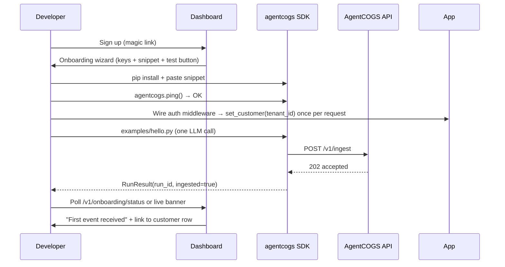
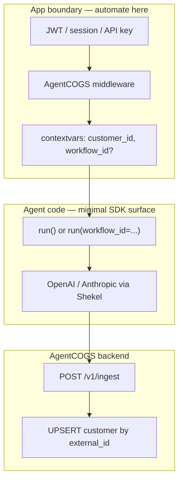

# SDK Customer Journey — Technical Plan

**Status:** Implemented (core) · May 2026  
**Owner:** Engineering  
**North-star metric:** **Time to first verified event (TTFVE)** — signup → first `cost_events` row visible in dashboard in **&lt; 10 minutes** without Docker, for a developer with an existing OpenAI or Anthropic key.

**Benchmarks (industry):**
- Helicone: first request logged in ~2 minutes via proxy URL change ([quickstart](https://docs.helicone.ai/quick-start))
- Langfuse: `auth_check()` + `flush()` + “see your first trace” loop ([Python SDK](https://langfuse.com/docs/observability/sdk/python/sdk-v3))
- Stripe: sub-5-minute TTFAC via 3-step quickstart + test mode ([APIScout SDK guide](https://apiscout.dev/guides/how-to-build-api-sdk-developers-use-2026))
- PostHog / Intercom: installation health checks surfaced to product UI ([PostHog health checks](https://posthog.com/handbook/cs-and-onboarding/health-checks), [Intercom installation health](https://developers.intercom.com/docs/build-an-integration/learn-more/installation-health-check))

---

## 1. Problem statement

AgentCOGS’s **product promise** (2-line SDK, per-customer margin) is strong, but the **integration journey** is fragmented:

| Stage | Current state | Failure mode |
|-------|---------------|--------------|
| Discover | `prototype/demo.py` (mock) vs real SDK vs Docker demo | “It only prints JSON” |
| Account | Magic link works; Settings snippet incomplete | `ConfigurationError` on missing `workspace_id` |
| Install | `pip install agentcogs` | No `ping()`, no proof keys work |
| Integrate | `init` + `run(customer_id=...)` every call | Repetitive tenant id; “why doesn’t install discover my customers?” |
| Verify | Fire-and-forget ingest | Empty dashboard, silent telemetry loss |
| Operate | Margin needs revenue in dashboard | SDK-only gives cost, not margin story |

Root causes are **architectural** (SDK + API + dashboard), not copy alone:

1. **No closed feedback loop** from SDK → “event received” in UI  
2. **Three onboarding paths** (mock demo, seeded Docker, live script) with no single canonical path  
3. **Silent degradation** (fail-open budget, swallowed `finally`, outbox invisible)  
4. **Sales UI ahead of SDK** (`node_costs` in mock, empty in production)  
5. **Attribution requires repeating `customer_id`** — no request-scoped context; feels manual vs “automated” observability tools (which still require a user/tenant id via header or metadata)

This plan fixes journey friction in **four phases** over ~6–8 weeks of focused engineering (can be parallelized), including **attribution automation** (set tenant once per request, not on every agent line).

**Product rule (attribution):** We never guess which B2B customer a run belongs to. We **automate propagation** of an id the app already knows at the auth/request boundary. Wrong attribution is worse than an extra parameter.

---

## 2. Target customer journey (end state)



**Success criteria (Phase 1 done):**
- New workspace sees onboarding UI within 30s of first login  
- `agentcogs.ping()` returns in &lt; 2s with actionable errors  
- `examples/hello_agentcogs.py` produces a row in &lt; 60s  
- Dashboard shows **Waiting for first event** until `cost_events` count &gt; 0 for workspace  
- Quickstart documents **one** tenant hook (`set_customer` or explicit `customer_id`), not repeated ids in every function  

---

## 3. Architecture overview

### 3.1 New components (high level)

```text
┌─────────────────────────────────────────────────────────────────┐
│                        Dashboard (React)                         │
│  /onboarding  ·  empty states  ·  "Test connection" (optional)   │
└────────────────────────────┬────────────────────────────────────┘
                             │ JWT
┌────────────────────────────▼────────────────────────────────────┐
│                     Backend (FastAPI)                              │
│  GET  /v1/sdk/ping          (API key auth — same as ingest)       │
│  GET  /v1/onboarding/status (JWT — first_event_at, sdk_seen)     │
│  POST /v1/onboarding/test-event (JWT — server-side smoke, opt)   │
│  GET  /health/ready         (deps: PG + Redis)                   │
└────────────────────────────┬────────────────────────────────────┘
                             │
┌────────────────────────────▼────────────────────────────────────┐
│                     SDK (Python)                                 │
│  ping() · RunResult · shutdown() · outbox status                   │
│  set_customer() / contextvars · optional run() without customer_id │
│  FastAPI middleware (Phase 2) · LangGraph hook (Phase 3)         │
└─────────────────────────────────────────────────────────────────┘
```

### 3.2 Design principles

1. **Prove before polish** — TTFVE beats LangGraph auto-instrumentation in Phase 1  
2. **Fail loud in dev, fail safe in prod** — `AGENTCOGS_STRICT=1` / `init(strict=True)` for onboarding; default fail-open budget unchanged for SMB  
3. **Idempotency everywhere** — keep `run_id` as PK; expose it to developers ([Stripe idempotency](https://docs.stripe.com/api/idempotent_requests))  
4. **One canonical path** — `docs/quickstart.md` + `examples/hello_agentcogs.py` + hosted API; demote Docker to “local full stack”  
5. **Don’t break existing integrators** — all SDK changes backward compatible (new optional kwargs, new functions)  
6. **Automate at the boundary** — tenant/customer id is set once per request, job, or graph invoke; SDK propagates via context (see §3.3)

### 3.3 Attribution automation (customers & workflows)

**What install does *not* do (by design):**

| Expectation | Reality |
|-------------|---------|
| Discover all customers in their DB | No — SDK has no DB access |
| List all LangGraph agents in the repo | No — runtime graphs are dynamic |
| Attribute LLM calls without a tenant boundary | No — would lump all cost on one customer |

**What we automate instead (layers):**

```text
Layer 1  Request context     set_customer(tenant_id) once → run() omits customer_id
Layer 2  HTTP middleware     FastAPI/Starlette: tenant from JWT → auto context
Layer 3  Framework hooks       LangGraph configurable / LangChain callback → context + workflow_id + node_costs
Layer 4  Customer catalog      POST /v1/customers/import — pre-fill dashboard (Stripe/CSV); does NOT attribute alone
Layer 5  Proxy/gateway (defer) Passive LLM capture — conflicts with non-proxy positioning; optional future
```



**Comparison:** Helicone still requires `Helicone-User-Id` (or equivalent) per request for per-customer cost — same concept as `customer_id`, different transport. Our automation goal is **not repeating that id in every inner function**.

**Lazy customer creation (unchanged):** First ingest with `customer_id="acme_123"` upserts `customers.external_id` in Postgres. Import API (Layer 4) only pre-seeds names/revenue/budget.

| Automate | Keep explicit (once per boundary) |
|----------|-----------------------------------|
| LLM token/cost inside `run()` | Which string = billing customer (`tenant_id`) |
| OpenAI/Anthropic via Shekel | One tenant per HTTP request / job |
| Upsert customer row on ingest | `workflow_id` label (or convention from graph name) |
| Context propagation | Revenue & margin in dashboard |

---

## 4. Phase 0 — Foundations (3–5 days)

**Goal:** Instrumentation and contracts so we can measure TTFVE and ship safely.

### 4.1 Metrics & logging

| Work item | Implementation |
|-----------|----------------|
| SDK version in ingest | Add header `X-AgentCOGS-SDK-Version: {__version__}` in `client.py` (fix SDK-7 hardcoded UA at same time) |
| Workspace “SDK seen” | On first authenticated ingest per workspace, `UPDATE workspaces SET sdk_first_seen_at = NOW() WHERE id=$1 AND sdk_first_seen_at IS NULL` |
| TTFVE tracking | `first_cost_event_at` on workspace (set on first `cost_events` insert for workspace) |

**Migration:** `backend/migrations/versions/002_onboarding.sql`

```sql
ALTER TABLE workspaces
  ADD COLUMN IF NOT EXISTS sdk_first_seen_at TIMESTAMPTZ,
  ADD COLUMN IF NOT EXISTS first_cost_event_at TIMESTAMPTZ;
```

**Acceptance:** Metabase/SQL can compute median hours from `workspaces.created_at` → `first_cost_event_at`.

### 4.2 Health endpoints

Split liveness/readiness per [API health check best practices](https://asoasis.tech/articles/2026-04-07-0253-rest-api-health-check-endpoint-design/):

| Route | Auth | Checks |
|-------|------|--------|
| `GET /health` | None | Process up (keep today) |
| `GET /health/ready` | None | `SELECT 1` on PG, `PING` Redis, timeout 200ms each |

**Files:** `backend/app/main.py`, `backend/tests/test_ingest.py`

---

## 5. Phase 1 — “First event in 10 minutes” (P0, ~2 weeks)

**Goal:** Self-serve loop without Docker. Highest ROI.

### 5.1 SDK: `ping()` and connection diagnostics

**API:**

```python
def ping(timeout_seconds: float | None = None) -> PingResult:
    """Verify API key, workspace, and reachability. Raises ConfigurationError or PingError."""
```

**Behavior:**
1. Requires `init()` (or env) — no implicit init on ping (explicit is better for onboarding scripts)  
2. `GET {endpoint}/v1/sdk/ping` with Bearer API key  
3. Response: `{ "ok": true, "workspace_id": "...", "plan": "free", "server_time": 123 }`  
4. Errors mapped:
   - 401 → `PingError("Invalid API key")` + doc link  
   - Connection / timeout → `PingError("Cannot reach {endpoint}")`  
   - 404 → wrong endpoint URL hint  

**Backend:** `backend/app/routes/sdk.py`

```python
@router.get("/v1/sdk/ping")
async def sdk_ping(ws: dict = Depends(auth_workspace_by_api_key)):
    return {"ok": True, "workspace_id": str(ws["id"]), "plan": ws["plan"]}
```

**Files:**
- `src/agentcogs/ping.py` (new)
- `src/agentcogs/__init__.py` — export `ping`, `PingResult`, `PingError`
- `backend/app/routes/sdk.py`
- `tests/test_ping.py`

**Acceptance:** `python -c "import agentcogs; agentcogs.init(...); print(agentcogs.ping())"` prints OK against local + staging.

---

### 5.2 SDK: `RunResult` and optional synchronous ack

**Problem:** Developers cannot correlate code → dashboard row.

**API change (backward compatible):**

```python
@contextmanager
def run(...) -> Iterator[RunContext]:
    ...

class RunContext:
    run_id: str
    customer_id: str
    workflow_id: str

    def wait_for_ingest(self, timeout: float = 5.0) -> IngestStatus:
        """Block until ingest 202 or failure. For onboarding/tests only."""
```

**Implementation notes:**
- Always generate `run_id` at enter; expose on `RunContext`  
- Default path unchanged: background `emit_event`  
- `wait_for_ingest`: use a **sync** POST path (new `emit_event_sync` for tests/onboarding) OR poll `GET /v1/events/{run_id}` (requires new read endpoint — heavier)  
- **Recommendation:** add `emit_event_sync` internal function used only by `wait_for_ingest` to avoid new read API in P0  

**Logging (SDK-3 fix):**
- Replace bare `except: pass` with `log.warning("telemetry failed", exc_info=True)`  
- Optional `init(on_telemetry_error: Callable[[Exception], None] = None)`

**Files:** `src/agentcogs/budget.py`, `src/agentcogs/client.py`, `tests/test_budget.py` (assert `emit_event` called once)

---

### 5.3 SDK: `shutdown()` and serverless

**Problem:** Lambda/short scripts lose events (Langfuse documents `flush()` — [low-level SDK](https://python-sdk-v2.docs-snapshot.langfuse.com/docs/observability/sdk/python/low-level-sdk/)).

```python
def shutdown(drain_timeout: float = 10.0) -> ShutdownResult:
    """Drain outbox, close httpx client. Call at process exit or Lambda handler end."""
```

- Register `atexit` hook when `init()` called (opt-out via `init(register_atexit=False)`)  
- Bounded thread pool drain (see Phase 2)  
- Return `{ "outbox_sent": n, "outbox_failed": m }`

**Files:** `src/agentcogs/shutdown.py`, `src/agentcogs/client.py` (`_reset_client()` on re-init)

---

### 5.4 Dashboard: onboarding wizard + fix Settings snippet

**Route:** `/onboarding` — redirect from `/` when `first_cost_event_at IS NULL` (after login).

**Steps (UI):**
1. **Install** — `pip install agentcogs`  
2. **Configure** — copy block with **all** required fields:

```python
import agentcogs

agentcogs.init(
    api_key="acg_live_...",
    workspace_id="550e8400-e29b-41d4-a716-446655440000",
    endpoint="https://api.agentcogs.dev",  # omit for production default
)

# Verify connection
print(agentcogs.ping())

# Attribute to a tenant (pick one pattern):
# A) Explicit per run:
#     with agentcogs.run(customer_id="your_tenant_id", workflow_id="hello"): ...
# B) Set once per request (recommended for FastAPI):
#     agentcogs.set_customer("your_tenant_id")
#     with agentcogs.run(workflow_id="hello"): ...
```

3. **Run test script** — download link to `examples/hello_agentcogs.py` (or inline copy)  
4. **Confirm** — poll `GET /v1/onboarding/status` every 2s for 60s:

```json
{
  "first_event": false,
  "sdk_seen": false,
  "first_event_at": null,
  "checklist": {
    "ping_ok": null,
    "has_customers": false
  }
}
```

5. **Done** — CTA to leaderboard + “Set revenue on customers for margin”

**Settings.tsx fix:** Same complete snippet; show `workspace_id={ws.id}`; tabs for “Env vars” (`AGENTCOGS_API_KEY`, `AGENTCOGS_WORKSPACE_ID`, `AGENTCOGS_ENDPOINT`).

**Leaderboard empty state:** When `customer_count === 0` and no events, show onboarding card instead of empty table.

**Files:**
- `dashboard/src/pages/Onboarding.tsx` (new)
- `dashboard/src/App.tsx` — route + redirect logic
- `dashboard/src/pages/Settings.tsx`
- `dashboard/src/pages/Leaderboard.tsx`
- `dashboard/src/api.ts` — `onboardingStatus()`
- `backend/app/routes/onboarding.py` (new)

**Acceptance:** E2E Playwright or manual: new dev-login workspace → onboarding → run hello script → banner clears.

---

### 5.5 Canonical quickstart artifact

**Create:** `examples/hello_agentcogs.py`

```text
1. Reads AGENTCOGS_API_KEY, AGENTCOGS_WORKSPACE_ID, AGENTCOGS_ENDPOINT from env
2. agentcogs.ping()
3. One minimal LLM call (OpenAI if OPENAI_API_KEY else Anthropic if ANTHROPIC_API_KEY else simulate offline)
4. ctx.wait_for_ingest(timeout=10)
5. Prints run_id + "Open dashboard → Customers"
```

**Create:** `docs/quickstart.md` — single path, no Docker. Link from README.

**Deprecate in docs (not delete):** `prototype/demo.py` labeled “sales mock only — not the SDK”.

**Acceptance:** Documented path works on staging with only pip + env vars.

---

### 5.6 Config: `init(strict=...)` for budget (SDK-1 partial)

```python
def init(..., budget_mode: Literal["open", "closed"] = "open"):
```

- `open` (default): current fail-open on budget fetch errors  
- `closed`: budget fetch failure raises `AgentCOGSError` before `run()` body  
- Document in quickstart: production SMB default vs enterprise option  

**Files:** `src/agentcogs/config.py`, `src/agentcogs/client.py` (`fetch_budget`)

---

### 5.7 SDK: Request-scoped customer context (Layer 1 — P0)

**Problem:** Devs must pass `customer_id=` on every `run()`, even though tenant is already on `request.state` / auth. Feels non-automated.

**Solution:** `contextvars` + `set_customer()` / `set_workflow()`; `run()` resolves from context when kwargs omitted.

**API:**

```python
def set_customer(customer_id: str | None) -> None:
    """Set billing customer for current context (async-safe). Pass None to clear."""

def set_workflow(workflow_id: str | None) -> None:
    """Optional: default workflow for subsequent run() in this context."""

def get_customer() -> str | None:
    """Read current context customer (for tests)."""

@contextmanager
def run(
    customer_id: str | None = None,  # optional if set_customer() called
    workflow_id: str | None = None,    # optional; falls back to context or "default"
    ...
) -> Iterator[RunContext]:
    resolved_customer = customer_id or get_customer()
    if not resolved_customer:
        raise ConfigurationError(
            "customer_id required: pass customer_id= to run() or call "
            "set_customer() in middleware before agent code."
        )
    ...
```

**Resolution order (document clearly):**

1. `run(customer_id=...)` argument (wins)  
2. `set_customer()` context  
3. Else → `ConfigurationError` with link to `docs/concepts/customer-id.md`

**Async safety:** Use `contextvars.ContextVar[str | None]` — safe for FastAPI, asyncio workers, threaded WSGI (each request gets own context).

**Onboarding snippet (target DX):**

```python
# FastAPI — dependency or middleware (see Phase 2 for middleware helper)
@app.post("/agents/run")
async def handle(req: Request):
    agentcogs.set_customer(req.state.tenant_id)
    with agentcogs.run(workflow_id="support_bot"):
        return await asyncio.to_thread(graph.invoke, state)
```

**Files:**
- `src/agentcogs/context.py` (new) — `ContextVar`, getters/setters  
- `src/agentcogs/budget.py` — resolve customer/workflow  
- `src/agentcogs/__init__.py` — export `set_customer`, `set_workflow`, `get_customer`  
- `tests/test_context.py` (new) — nested contexts, override via kwarg  
- `docs/concepts/customer-id.md` — tenant mapping playbook (start in Phase 1, expand Phase 3)

**Acceptance:**
- `run()` without args after `set_customer("x")` ingests with `customer_id=x`  
- Explicit `run(customer_id="y")` overrides context  
- Missing both → clear `ConfigurationError` (not silent wrong customer)

**Product copy:** “Set tenant on the request; wrap the agent once — we attribute the rest.”

---

### Phase 1 exit checklist

- [ ] TTFVE &lt; 10 min measured on staging for 3 internal testers  
- [ ] Settings snippet includes `workspace_id`  
- [ ] `set_customer()` + `run()` without `customer_id` documented in quickstart  
- [ ] `pytest` + `./test_e2e.sh` green  
- [ ] No regression on ingest idempotency or budget exceeded path  

---

## 6. Phase 2 — Reliability & observability (P1, ~2 weeks)

**Goal:** Production confidence; reduce silent data loss.

### 6.1 Thread pool + backpressure (SDK-2)

Replace per-run daemon thread:

```python
_executor = ThreadPoolExecutor(max_workers=4, thread_name_prefix="agentcogs-ingest")

def emit_event(event):
    _executor.submit(_emit_event_impl, event)
```

- `init(max_ingest_workers=4)`  
- `shutdown()` waits on executor with timeout  

### 6.2 Outbox v2

| Feature | Spec |
|---------|------|
| Dead letter | After 8 attempts → `status='dead'` column |
| CLI | `python -m agentcogs.outbox status` → `{ pending, dead, oldest_pending_age }` |
| Dashboard (optional P2) | Settings card: “N events pending sync” if we add SDK→API status endpoint later |

**Pattern:** Align with Stripe meter event durability ([usage-based billing](https://docs.stripe.com/billing/subscriptions/usage-based/how-it-works)) — local queue + idempotent `run_id`.

**Files:** `src/agentcogs/outbox.py`, `tests/test_outbox.py` (backoff with `freezegun`)

### 6.3 Installation health API (for dashboard + support)

**Inspired by:** [Intercom installation health check](https://developers.intercom.com/docs/build-an-integration/learn-more/installation-health-check)

`GET /v1/installation/health` (JWT):

```json
{
  "state": "OK" | "UNHEALTHY" | "UNKNOWN",
  "checks": [
    { "name": "api_key_valid", "ok": true },
    { "name": "ingest_recent_24h", "ok": false, "message": "No events in 24h" },
    { "name": "outbox_stale", "ok": true }
  ],
  "message": null
}
```

Note: outbox is client-side only — check `ingest_recent_24h` and `sdk_first_seen_at` from DB.

**Dashboard:** Settings banner when UNHEALTHY.

### 6.4 `GET /v1/events/by-run/{run_id}` (optional)

Lets dashboard deep-link from onboarding without polling leaderboard. Auth: API key or JWT scoped to workspace.

**Query:** `SELECT * FROM cost_events WHERE id=$1 AND workspace_id=$2`

---

### 6.5 SDK: FastAPI / Starlette middleware (Layer 2)

**Goal:** Zero `set_customer()` calls in route handlers for standard JWT/session apps.

```python
from agentcogs.integrations.fastapi import AgentCOGSMiddleware

app.add_middleware(
    AgentCOGSMiddleware,
    customer_id=lambda request: request.state.tenant_id,
    workflow_id=lambda request: request.headers.get("X-Workflow-Id", "default"),
)
```

**Behavior:**
- On each request: `set_customer(...)` before call_next; `set_customer(None)` in `finally`  
- Does **not** auto-wrap responses in `run()` — handlers still use `with agentcogs.run():` or we document optional “auto-run” flag in P3  
- Skip paths: `/health`, static assets (configurable `exclude_paths`)

**Files:**
- `src/agentcogs/integrations/fastapi.py` (new)  
- `src/agentcogs/integrations/__init__.py`  
- `tests/test_fastapi_middleware.py` (TestClient)  
- `docs/integrations/fastapi.md` — promote from stub to full guide

**Acceptance:** Sample app: middleware + `with run():` → correct `customer_id` on ingest without handler calling `set_customer`.

---

### 6.6 Customer catalog import API (Layer 4)

**Goal:** Pre-populate dashboard (names, revenue, budgets, Stripe ids) before first LLM event. **Does not replace** SDK attribution.

**API:**

```http
POST /v1/customers/import
Authorization: Bearer <JWT>
Content-Type: application/json

{
  "customers": [
    {
      "external_id": "acme_123",
      "display_name": "Acme Corp",
      "monthly_revenue_usd": 8200,
      "monthly_budget_usd": 500,
      "stripe_customer_id": "cus_..."
    }
  ],
  "mode": "upsert"
}
```

**Response:** `{ "created": n, "updated": m, "errors": [] }`

**Implementation:**
- Batch upsert on `(workspace_id, external_id)` — same keys as ingest upsert  
- Invalidate Redis budget cache keys for touched customers  
- Plan limit: respect `customer_cap` on free tier (count existing + new)

**Future (P3, not blocking):**
- `POST /v1/integrations/stripe/sync-customers` — pull Stripe Customer list into import shape  
- Webhook on partner’s `tenant.created` → server-side import (design partner only)

**Dashboard (optional):** Settings → “Import customers” CSV upload calling same endpoint.

**Files:**
- `backend/app/routes/customers.py` — add `POST /import` (or `customers_import.py`)  
- `backend/app/models.py` — `CustomerImportIn`, row schema  
- `backend/tests/test_customer_import.py`  
- `docs/integrations/customer-import.md`

**Acceptance:** Import 10 customers → leaderboard shows rows with $0 cost until first `run()`; PATCH revenue visible before any ingest.

---

## 7. Phase 3 — Framework depth (P1/P2, ~3 weeks)

**Goal:** Match competitor depth for agent SaaS ICP (LangGraph shops).

### 7.1 LangGraph integration (Layer 3)

**Convention (document + enforce in helper):** Pass tenant in LangGraph configurable; SDK reads it before invoke.

```python
# Partner app
agentcogs.set_customer(config["configurable"]["tenant_id"])

result = graph.invoke(
    state,
    config={
        "configurable": {
            "tenant_id": request.state.tenant_id,
            "thread_id": "...",
        }
    },
)
```

**Helper (ship in Phase 3):**

```python
from agentcogs.integrations.langgraph import agentcogs_run

with agentcogs_run(graph, state, config, workflow_id="research_agent"):
    return graph.invoke(state, config)  # sets context + run() wrapper
```

**Options for `node_costs`:**

| Option | Effort | UX |
|--------|--------|-----|
| A. Document wrap `graph.invoke` + `set_customer` only | S | Phase 3 week 1 |
| B. Shekel LangGraph callback | L | Real `node_costs` (SDK-8) |
| C. LangChain `CallbackHandler` | M | LC-native shops |

**Recommendation:** Ship **A** + `agentcogs_run()` helper Week 1; spike **B** in parallel.

**Deliverables:**
- `src/agentcogs/integrations/langgraph.py`  
- `docs/integrations/langgraph.md` — configurable `tenant_id` contract  
- `examples/langgraph_research_agent.py`  
- Integration test with mocked LLM graph (2 nodes)

### 7.2 Provider matrix

**Doc:** `docs/integrations/providers.md`

| Provider | Support | How |
|----------|---------|-----|
| OpenAI | Auto | Shekel patch |
| Anthropic | Auto | Shekel patch |
| Other | Manual | `price_per_1k_tokens` + manual `shekel.record_*` if available |
| No LLM (CI) | `offline=True` | Tests |

### 7.3 Async FastAPI pattern

**Doc:** `docs/integrations/fastapi.md` (full guide; middleware from §6.5)

```python
@app.post("/run")
async def run_agent(request: Request):
    # customer already set by AgentCOGSMiddleware
    with agentcogs.run(workflow_id="support"):
        return await asyncio.to_thread(graph.invoke, state)
```

Future: native `async def arun()` with `httpx.AsyncClient` (Phase 4).

### 7.4 `customer_id` playbook

**Doc:** `docs/concepts/customer-id.md` (expand after §5.7)

| Source in partner app | Use as `customer_id` | Notes |
|-----------------------|----------------------|-------|
| `tenants.id` / `org_id` | Same string | Recommended default |
| Clerk / Auth0 `org_id` | Same string | Set in middleware |
| Stripe `cus_*` | Store on `customers.stripe_customer_id`; SDK uses **your** tenant id | Don’t use Stripe id as `customer_id` unless it *is* your tenant key |
| User id (B2C) | Only if you bill per end-user | B2B usually bills per org |

- One `run()` per **user request** / job, not per LangGraph node  
- Background workers: `set_customer()` at job dequeue  
- Celery: `set_customer(tenant_id)` first line of task  

### 7.5 Align sales demo with real SDK

- Update `prototype/demo.py` header: MOCK ONLY  
- Optional: `prototype/demo_live.py` thin wrapper calling real SDK in offline print mode  
- Demo call script step 7: use `examples/hello_agentcogs.py` not mock  

---

## 8. Phase 4 — Scale & second runtime (P2/P3, ~4+ weeks)

| Item | Notes |
|------|-------|
| TypeScript SDK | OpenAPI-generated client + `run()` wrapper; or HTTP-only thin SDK first |
| `async`/`arun()` | httpx async + asyncio.create_task for emit |
| LangGraph `node_costs` | Complete SDK-8 |
| Hosted sandbox | Ephemeral API keys per signup (rate-limited) — reduces fear of breaking prod |
| Stripe meter wizard | Link `run_id` → meter `identifier` in docs ([meter events](https://docs.stripe.com/api/billing/meter-event/create)) |
| SDK Doctor API | PostHog-style version audit ([SDK doctor](https://posthog.com/docs/api/sdk-doctor)) — low priority |

---

## 9. API contract summary (new endpoints)

| Method | Path | Auth | Purpose |
|--------|------|------|---------|
| GET | `/v1/sdk/ping` | API key | SDK connectivity check |
| GET | `/v1/onboarding/status` | JWT | First event / SDK seen flags |
| GET | `/v1/installation/health` | JWT | Support + Settings banner |
| GET | `/v1/events/by-run/{run_id}` | JWT or API key | Onboarding deep link |
| GET | `/health/ready` | None | Ops readiness |
| POST | `/v1/customers/import` | JWT | Pre-seed customer catalog (Layer 4) |

---

## 10. SDK public API (end state)

```python
# Lifecycle
agentcogs.init(api_key, workspace_id, endpoint=..., budget_mode="open", on_telemetry_error=None)
agentcogs.ping() -> PingResult
agentcogs.shutdown() -> ShutdownResult

# Attribution context (Layer 1 — set once per request/job)
agentcogs.set_customer(tenant_id)      # or use AgentCOGSMiddleware
agentcogs.set_workflow(workflow_id)    # optional
agentcogs.get_customer() -> str | None

# Per agent run (customer_id optional if context set)
with agentcogs.run(
    customer_id=None,   # optional: kwarg overrides context
    workflow_id="support",
    metadata={},
    price_per_1k_tokens=None,
) as ctx:
    ...
    # ctx.run_id, ctx.customer_id (resolved)
    # ctx.wait_for_ingest(timeout=5)  # onboarding / tests

# Integrations (optional imports)
from agentcogs.integrations.fastapi import AgentCOGSMiddleware
from agentcogs.integrations.langgraph import agentcogs_run

# Errors
ConfigurationError, CustomerBudgetExceededError, PingError, AgentCOGSError

# CLI
python -m agentcogs.outbox status
```

---

## 11. Testing strategy

| Layer | What to add |
|-------|-------------|
| SDK unit | `test_ping.py`, fix `test_normal_run_emits_event` assert `call_count == 1`, outbox dead-letter |
| SDK integration | `tests/integration/test_live_ping.py` (mark `@pytest.mark.integration`) |
| Backend | `test_sdk_ping.py`, `test_onboarding_status.py` |
| E2E | Extend `test_e2e.sh` Step: ping → run → verify row → onboarding status |
| Dashboard | Playwright: onboarding redirect + status poll (optional) |

**CI:** Phase 1 gates merge on unit + e2e; integration tests nightly.

---

## 12. Documentation deliverables

| Doc | Audience |
|-----|----------|
| `docs/quickstart.md` | All developers |
| `docs/SDK_CUSTOMER_JOURNEY_PLAN.md` | Internal (this file) |
| `docs/integrations/langgraph.md` | Agent SaaS |
| `docs/integrations/fastapi.md` | Backend engineers |
| `docs/concepts/customer-id.md` | Architects — tenant mapping + context vs kwarg |
| `docs/integrations/customer-import.md` | Ops — pre-seed leaderboard |
| `docs/troubleshooting.md` | Support (empty dashboard, $0 cost, budget exceeded, outbox, missing customer_id) |
| README | Link quickstart first; Docker second |

---

## 13. Rollout & risk

### 13.1 Feature flags

| Flag | Default | Controls |
|------|---------|----------|
| `ONBOARDING_WIZARD` | on in staging, off prod until QA | Dashboard redirect |
| `SDK_PING_ENABLED` | on | Backend route |

### 13.2 Backward compatibility

- `run()` still works without using `RunContext.wait_for_ingest`  
- `init()` new kwargs optional  
- Ingest schema unchanged  

### 13.3 Risks

| Risk | Mitigation |
|------|------------|
| `wait_for_ingest` blocks production traffic | Document “onboarding/tests only”; log warning if called when `AGENTCOGS_ENV=production` |
| Onboarding redirect annoys seeded demo workspaces | Skip redirect if `email = demo@agentcogs.dev` or `?skip_onboarding=1` |
| Ping abuse | Rate limit 60/min per API key (Redis) |
| Stale `set_customer` leaks across requests | Middleware must clear context in `finally`; document for manual use |
| Wrong tenant in async worker | Document job-level `set_customer` at dequeue; test nested contexts |

---

## 14. Work breakdown (suggested tickets)

### Sprint A (Phase 0 + 1a) — ~1 week
1. `002_onboarding.sql` migration  
2. `GET /v1/sdk/ping` + SDK `ping()`  
3. Settings snippet + env tab  
4. `RunContext.run_id` + logging fix in `finally`  
5. **`context.py` + `set_customer()` / optional `customer_id` on `run()`** (§5.7)

### Sprint B (Phase 1b) — ~1 week
6. `examples/hello_agentcogs.py` + `docs/quickstart.md` (context-based snippet)  
7. Onboarding page + `/v1/onboarding/status`  
8. Leaderboard empty state  
9. `wait_for_ingest` + sync emit for tests  
10. **`docs/concepts/customer-id.md`** (initial — context + explicit kwarg)

### Sprint C (Phase 2) — ~2 weeks
11. Thread pool + `shutdown()`  
12. Outbox dead + CLI  
13. `/v1/installation/health`  
14. `/health/ready`  
15. **`AgentCOGSMiddleware`** (§6.5)  
16. **`POST /v1/customers/import`** (§6.6)

### Sprint D (Phase 3) — ~3 weeks
17. **`agentcogs_run()` LangGraph helper** + docs (§7.1)  
18. Provider matrix + troubleshooting  
19. Demo script alignment  
20. Shekel / LangGraph spike for `node_costs` (SDK-8)

---

## 15. What we explicitly defer

- Full TypeScript SDK (until Python TTFVE proven)  
- **Install-time discovery** of all customers/agents from DB or codebase  
- Proxy/gateway mode (Helicone-style) — Layer 5; conflicts with “no proxy” positioning  
- Replacing Shekel — not a journey problem  
- Public demo Docker in primary quickstart — keep for sales, not self-serve  
- Auto-wrap every FastAPI route in `run()` without explicit `with` block (magic, hides scope)  

---

## 16. Success metrics (90 days)

| Metric | Baseline (estimate) | Target |
|--------|---------------------|--------|
| TTFVE (signup → first event) | Unknown; many never complete | p50 &lt; 10 min on staging |
| % workspaces with ≥1 event in 7d | Low for self-serve | 40%+ |
| Support tickets “empty dashboard” | High in design partner phase | −80% |
| `ping()` failure rate | N/A | &lt; 5% after successful signup |
| Outbox dead letters per 1k runs | Unknown | &lt; 0.1% |
| % integrations using context vs repeated `customer_id=` kwarg | 0% | 60%+ new installs (telemetry via SDK header + docs survey) |

---

## 17. References

- Langfuse onboarding failure: [GitHub #9327](https://github.com/langfuse/langfuse/issues/9327)  
- Helicone proxy vs async: [docs](https://docs.helicone.ai/references/proxy-vs-async)  
- Stripe meter events & idempotency: [meter events](https://docs.stripe.com/api/billing/meter-event/create), [idempotent requests](https://docs.stripe.com/api/idempotent_requests)  
- OTel shutdown pattern: [getting started](https://opentelemetry.io/docs/getting-started/dev)  
- Internal debt register: `TECHNICAL_DEBT_REGISTER.md` SDK-1 through SDK-11  

---

## Appendix A — File touch list (Phase 1)

```text
src/agentcogs/
  __init__.py          # exports
  context.py           # NEW — set_customer, ContextVar
  ping.py              # NEW
  budget.py            # RunContext, resolve customer/workflow
  client.py            # ping HTTP, UA version, emit_event_sync
  config.py            # budget_mode
  integrations/
    __init__.py
    fastapi.py         # Phase 2 — AgentCOGSMiddleware
    langgraph.py       # Phase 3 — agentcogs_run()

backend/
  migrations/versions/002_onboarding.sql
  app/routes/sdk.py    # NEW
  app/routes/onboarding.py  # NEW
  app/routes/customers.py   # + POST /import (Phase 2)
  app/main.py          # routers, health/ready
  app/routes/ingest.py # sdk_first_seen_at, first_cost_event_at

dashboard/
  src/pages/Onboarding.tsx  # NEW
  src/pages/Settings.tsx
  src/pages/Leaderboard.tsx
  src/App.tsx
  src/api.ts

examples/hello_agentcogs.py       # NEW
examples/fastapi_tenant_agent.py  # Phase 2
examples/langgraph_research_agent.py  # Phase 3
docs/quickstart.md                # NEW
docs/concepts/customer-id.md      # NEW
docs/integrations/customer-import.md  # Phase 2
tests/test_ping.py                # NEW
tests/test_context.py             # NEW
tests/test_fastapi_middleware.py  # Phase 2
```

---

*Next step:* Review Phase 1 scope in standup, create GitHub issues from §14, start Sprint A with migration + `ping()` + `set_customer()` (smallest vertical slice that proves the loop and reduces attribution friction).
